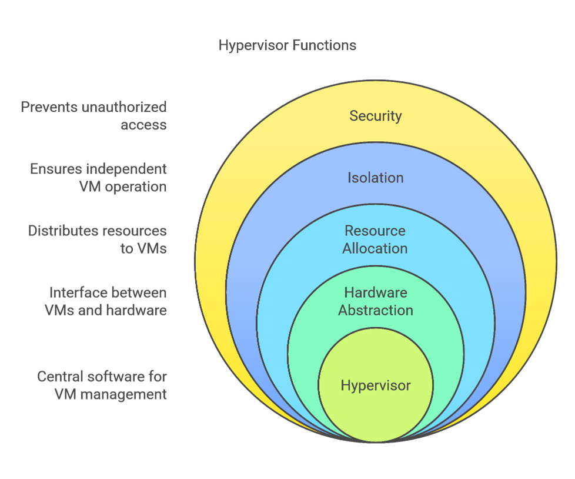

1. **Hypervisors**

**1.1 Introduction to Hypervisors**

A hypervisor, also known as a Virtual Machine Monitor (VMM), is a software layer that enables the creation and management of virtual machines (VMs). It abstracts the physical hardware and allows multiple operating systems to run concurrently on a single physical machine. Hypervisors are fundamental to virtualization technology, which has become a cornerstone of modern IT infrastructure, enabling efficient resource utilization, scalability, and flexibility.

2. ` `**Functions of a Hypervisor**
- **Resource Abstraction:** The hypervisor abstracts the physical hardware (CPU, memory, storage, etc.) and presents it to the VMs as virtual hardware.
- **Isolation:** Each VM operates independently, isolated from other VMs, ensuring that a failure in one VM does not affect others.
- **Resource Allocation:** The hypervisor allocates physical resources to VMs based on predefined policies and requirements.
- **Scheduling:** The hypervisor schedules CPU time and other resources among the VMs to ensure fair and efficient utilization.

  

**2. Ring Levels on x86 Processors**

**2.1 Introduction to Ring Levels**

X86 processors use a protection mechanism known as “ring levels” or “privilege levels” to enforce security and stability. These rings are hierarchical, with each level having different privileges and access rights to the system’s resources. The rings are numbered from 0 to 3, with Ring 0 being the most privileged and Ring 3 the least.

**2.2 Ring Levels Explained**

- **Ring 0 (Kernel Mode):** 

  This is the most privileged level, where the operating system kernel and hypervisor run. Code running in Ring 0 has direct access to hardware and can execute any CPU instruction.

- **Ring 1 and Ring 2:** 

  These levels are rarely used in modern operating systems. They were intended for device drivers and other system services but are generally not utilized.

- **Ring 3 (User Mode):** 

  This is the least privileged level, where most application software runs. Code running in Ring 3 has restricted access to hardware and must make system calls to the kernel for privileged operations.

  **2.3 Hypervisors and Ring Levels**

  Hypervisors typically operate in Ring 0, allowing them to manage hardware resources directly. However, some hypervisors use a technique called "ring deprivileging" to run the guest operating systems in a less privileged ring (e.g., Ring 1) while the hypervisor remains in Ring 0. This approach enhances security by isolating the hypervisor from the guest OS.

**3. Types of Hypervisors**

**3.1 Type 1 Hypervisors (Bare-Metal Hypervisors)**

Type 1 hypervisors run directly on the host's hardware without requiring a traditional operating system. They are often referred to as "bare-metal" hypervisors because they interact directly with the physical hardware.

- **Characteristics:**
  - High performance due to direct hardware access.
  - Typically used in enterprise environments.
  - Examples: VMware ESXi, Microsoft Hyper-V, Xen, and IBM PowerVM.
- **Use Cases:**
  - Data center virtualization.
  - Cloud computing infrastructure.
  - High-performance computing (HPC).

**3.2 Type 2 Hypervisors (Hosted Hypervisors)**

Type 2 hypervisors run on top of a conventional operating system, leveraging the host OS for hardware access and management.

- **Characteristics:**
  - Easier to set up and use compared to Type 1 hypervisors.
  - Generally used for desktop virtualization and development environments.
  - Examples: Oracle VirtualBox, VMware Workstation, and Parallels Desktop.
- **Use Cases:**
  - Software development and testing.
  - Running multiple operating systems on a personal computer.
  - Educational purposes.

**3.3 Comparison of Type 1 and Type 2 Hypervisors**

- Performance: Type 1 hypervisors generally offer better performance due to direct hardware access, while Type 2 hypervisors may introduce some overhead due to the host OS.
- Security: Type 1 hypervisors are considered more secure because they have a smaller attack surface and run directly on the hardware.
- Ease of Use: Type 2 hypervisors are typically easier to install and configure, making them more suitable for individual users and small-scale deployments**.**

**4. IBM PowerVM Hypervisors**

1. **Introduction to IBM PowerVM**

IBM PowerVM is a virtualization technology designed for IBM Power Systems. It provides advanced virtualization capabilities, including support for multiple operating systems, dynamic resource allocation, and high availability.

**4.2 Key Features of IBM PowerVM**

- Logical Partitioning (LPAR): 

  PowerVM allows the creation of multiple logical partitions on a single physical server, each running its own operating system.

- Dynamic LPAR (DLPAR): 

  Resources such as CPU, memory, and I/O can be dynamically reallocated between LPARs without downtime.

- Virtual I/O Server (VIOS): 

  The VIOS provides virtualized I/O resources to LPARs, reducing the need for dedicated physical I/O devices.

- Live Partition Mobility: 

  PowerVM supports the migration of running LPARs from one physical server to another without interruption, enhancing flexibility and availability.

  **4.3 Architecture of IBM PowerVM**

- Hypervisor (Power Hypervisor): The Power Hypervisor is a Type 1 hypervisor that runs directly on the Power Systems hardware. It provides the foundation for PowerVM's virtualization capabilities.
- Management Console: PowerVM includes a management console (HMC or IVM) for configuring and managing LPARs, VIOS, and other resources.
- Integration with AIX, IBM i, and Linux: PowerVM supports multiple operating systems, including AIX, IBM i, and various Linux distributions, making it a versatile solution for diverse workloads.

  **4.4 Use Cases for IBM PowerVM**

- Enterprise Data Centers: PowerVM is widely used in enterprise data centers for consolidating workloads, improving resource utilization, and ensuring high availability.
- Cloud Computing: PowerVM's advanced virtualization features make it suitable for cloud infrastructure, enabling efficient resource management and scalability.
- High Availability and Disaster Recovery: PowerVM's live partition mobility and dynamic resource allocation capabilities enhance business continuity and disaster recovery strategies.

